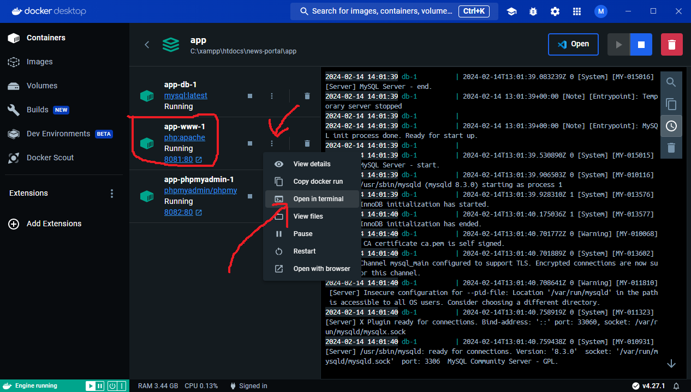
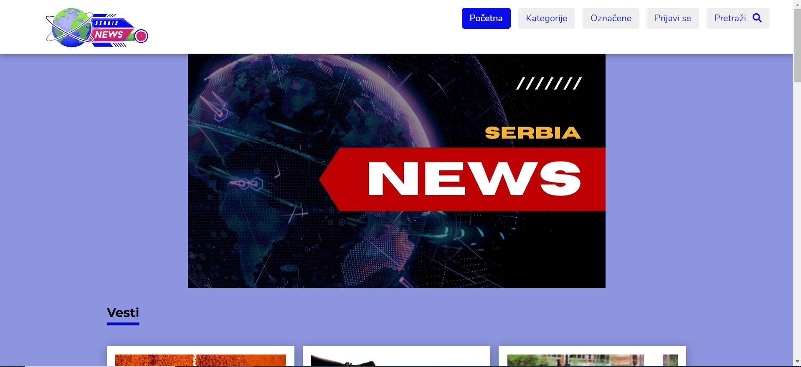
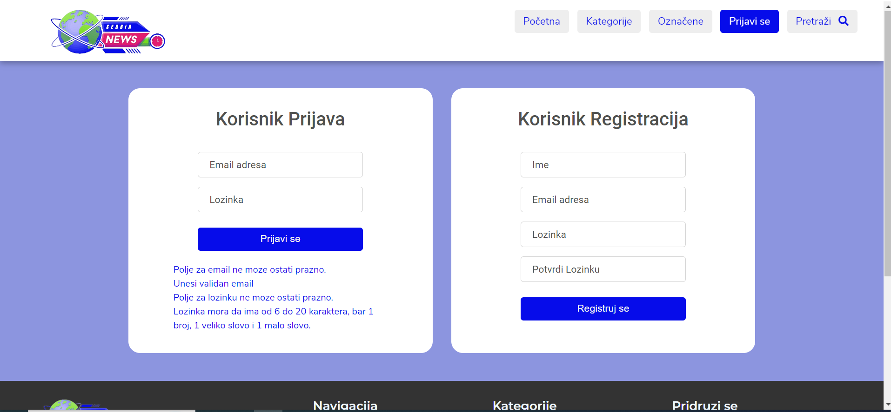
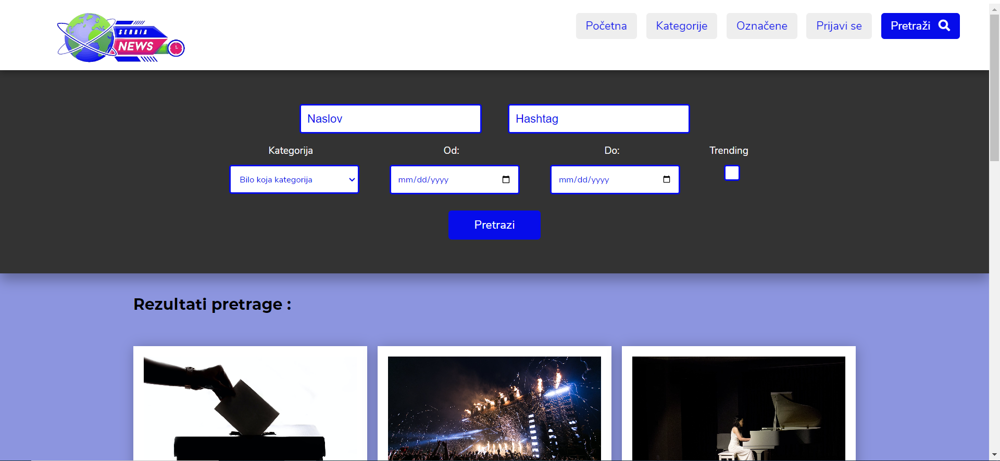
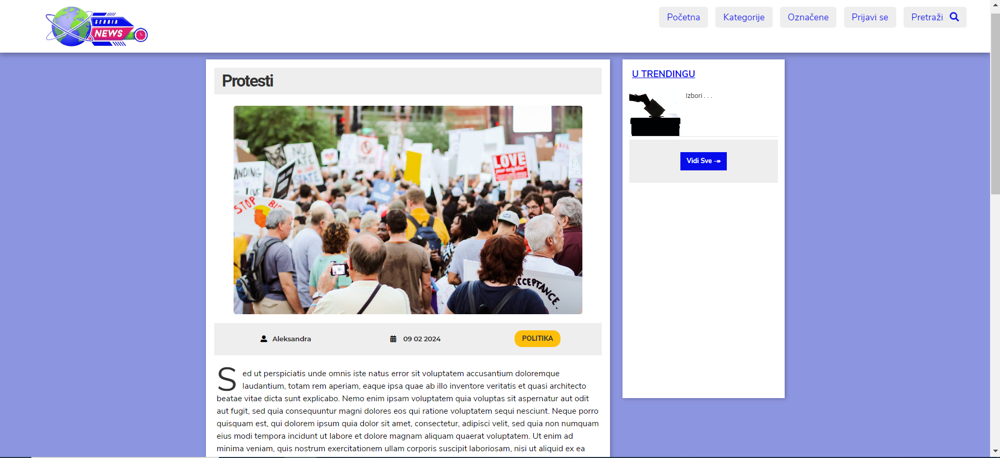
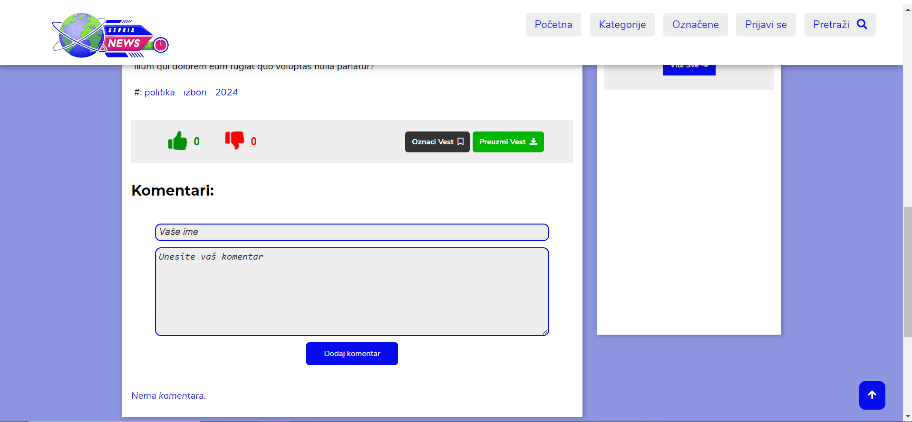
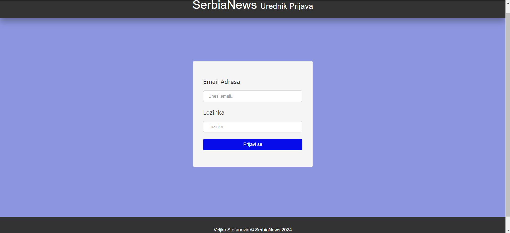
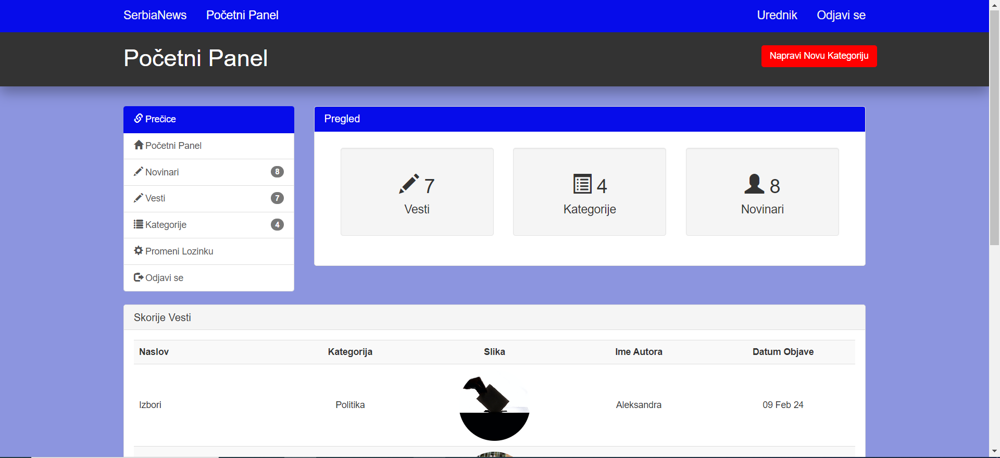

# SerbiaNews - Veljko Stefanović 613-2019

## Portal elektronskih novina - PISiBP


U ovom projektnom zadatku je kreirana i opisana struktura informacionog sistema za portal elektronskih novina. Korisnici mogu da citaju i pretrazuju vesti i nije im potrebna nikakva prijava za odredjene funkcije(kao sto je lajkovanje vesti i komentarisanje), dok za preuzimanje vesti(u PDF formatu) i njeno oznacavanje prijava je potrebna. Novinari mogu da kreiraju vesti i ograniceni su kategorijom koja ima je dodeljena od strane urednika koji je nadlezan za nju i on te vesti i pregleda pre nego sto je postavi aktivnom ili stavi u trending. Pored urednika koji je nadlezan za jednu kategoriju(vesti i novinare koji joj pripadaju ) postoji i glavni urednik koji postoji u sistemu koji moze da upravlja ostalim urednicima kao i svim vestima i novinarima, takodje moze i da menja kategorije(vrsi izmene na postojecim, brise i dodaje nove). Na portalu postoji implementiran sistem registracije i prijave.
<br>

Koriscene tehnologije:

- Front end: HTML, CSS, JavaScript, Bootstrap
- Back end: PHP, MySQL
- Docker (inicijalno xampp, kasnije su i kontejnerizovane komponente)
- Unit testovi: PhpUnit
  <br>


```
Admin prijava: 
email - admin@admin.com
password - Admin123
```
- Svi ostali korisnici se prijavljuju po principu:
```
             ime  |       email     | lozinka
             ---------------------------------
             ime ->   ime@ime.com   -> Ime1
Primer:    Bojan -> bojan@bojan.com -> Bojan1
```

## Vrste korisnika:

- Glavni urednik(admin)
- Urednik
- Novinar
- Korisnik sa nalogom
- Korisnik bez naloga


### Glavni urednik

Glavni urednik ima pristum listi svih vesti, novinara, urednika i kategorija i ima sva urednicka prava. Moze da pregleda vesti, da ih aktivira(odobri), da ih obrise i stavi u trending. Novinare moze da promovise u urednike kao i urednike da vrati u novinare, da obrise i urednika i novinara, kao i da im promeni kategoriju. Kategorije moze da kreira, menja i brise.

<hr style="font-size: 10px;margin: auto;" width="100%" >

### Urednik

Urednik ima pristup vestima iz svoje kategorije kao i novinarima i urednicima iste kategorije. Moze da pregleda vesti, da ih aktivira(odobri), da ih obrise i stavi u trending. Novinare moze da obrise promovise u urednike kao i urednike da vrati u novinare, da obrise i urednika i novinara. Naravno sve u okvirima svoje kategorije.

<hr style="font-size: 10px;margin: auto;" width="100%" >

### Novinar

Novinar moze da kreira vesti, da ih menja, salje zahtev za odobrenje kao i za brisanje. Vesti su iskljucivo kategorije kojoj pripada novinar i ne moze da je menja.

<hr style="font-size: 10px;margin: auto;" width="100%" >

### Korisnik sa nalogom

Korisnik koji ima nalog moze da cita vesti da ih pretrazuje i reaguje na njih. Reaguje lajkovanjem ili dislajkovanjem vesti kao i komentara ispod nje, koje i sam moze da postavi. Nalog mu omogucava da cuva vesti medju "Oznacene", a takodje moze i da ih preuzima u PDF formatu.

<hr style="font-size: 10px;margin: auto;" width="100%" >

### Korisnik bez naloga

Korisnik koji ima nalog moze da cita vesti da ih pretrazuje i reaguje na njih. Reaguje lajkovanjem ili dislajkovanjem vesti kao i komentara ispod nje, koje i sam moze da postavi. Bez naloga nema mogucnost cuvanja i preuzimanja vesti sa portala.

---

## Pokretanje aplikacije

- Kompletna aplikacija se nalazi na repozitorijumu i kada se preuzme potrebno je posedovati ono sto navedena arhitektura aplikacije zahteva. U slucaju da se pokrece preko Visual Studio Code-a dovoljno je otvoriti folder sa aplikacijom i u terminalu pokrenuti docker: komandom: "docker-compose up". Ako se radi u nekom drugom okruzenju moze se pokrenuti iz CMD terminala, ali je prethodno potrebno promeniti direktorijum u onaj u kom je aplikacija. Nakon sto se pokrene docker u pretrazivacu je dovoljno uneti "localhost:8081" ili "http://localhost:8081/index.php", a ako zelite da pristupite glavnom uredniku i ostalim urednicima: "http://localhost:8081/admin/login.php", nacin prijave je vec naveden iznad. PhpMyAdmin je na: "http://localhost:8082", username: "docker", password: "root". U slucaju da ne moze da se pristupi portalu zbog greske onda je verovatno potrebno otvoriti Docker aplikaciju i terminal za app-www-1(php:appache) kontejner i uneti sledecu komandu: "docker-php-ext-install mysqli" i nakon sto se izvrsi potrebno je samo osveziti stranicu.




## Slike Portala

#### Pocetna Strana


#### Login Strana


#### Strana za Pretragu


#### Strana koja prikazuje Vest


#### Strana za komentare


#### Urednik Login


#### Urednik Pocetna


